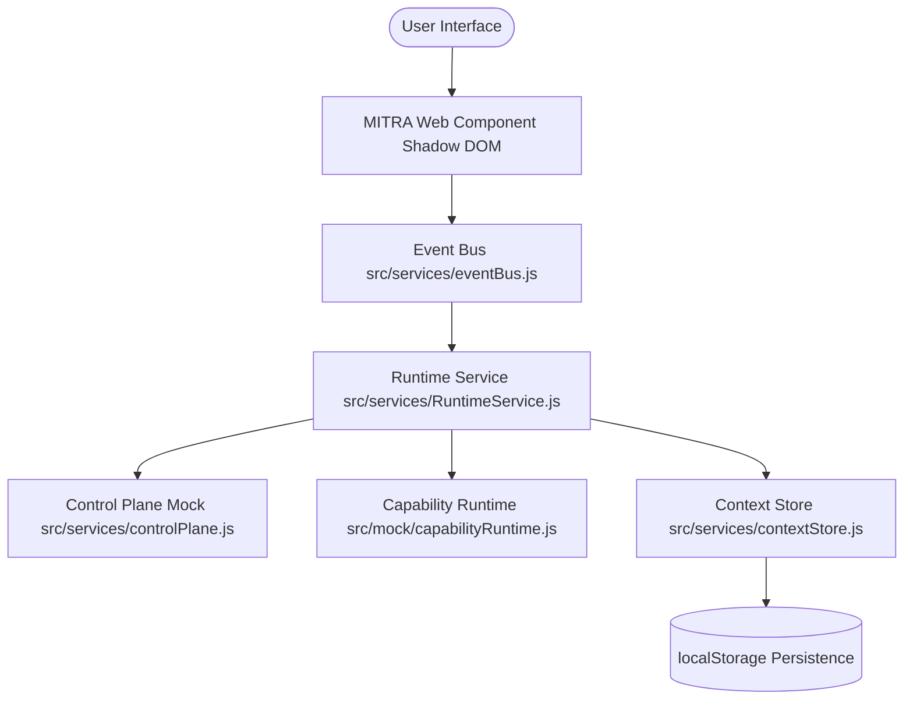
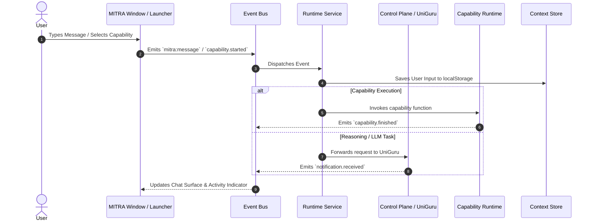
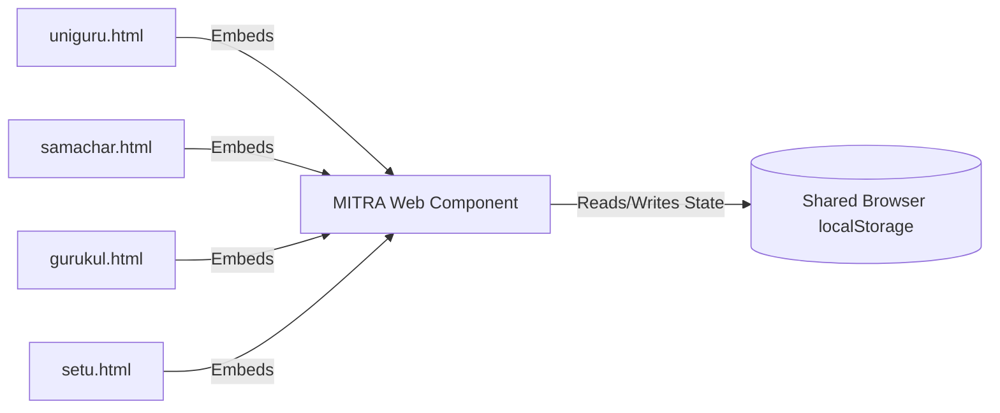

# MITRA Universal Companion - Architecture & Specification

## Architecture Overview

## Runtime Flow

## Integration Flow across BHIV Applications

## Review Readiness & Feature Checklist

- **Floating Companion Button**: Always visible bottom-right, pulsing animation, online indicator.
- **Expand / Collapse / Minimize Modes**: Fully supported.
- **Dock Modes**: Left, Right, Floating dock modes.
- **Notification State**: Badges, toasts, background notifications.
- **Conversation Surface**: Bubbles, timestamps, scrolling, history persistence.
- **Capability Launcher**: 9 capability cards (Analyze, OCR, Translate, Summarize, Image, PDF, Replay, Health, Settings).
- **Activity Indicator**: Idle, Thinking, Running Capability, Completed, Failed.
- **Runtime Integration & Event Bus**: Decoupled event-driven architecture with zero hardcoded assistant text.
- **Health Panel**: Live status, latency, version, sync time.
- **Cross-App Demo**: 4 host pages (`uniguru`, `samachar`, `gurukul`, `setu`) with shared persistent context.
- **Mobile Readiness**: Media queries handling tablets and mobile viewports seamlessly.
