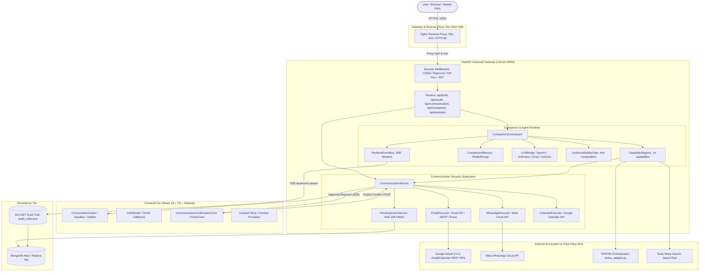

# MITRA — Architecture and Integration Map

> **Document Type:** Operational Handover Artifact
> **Source of Truth:** Repository Codebase, Configuration Files, Verified Tests
> **Repository:** `https://github.com/praj33/MITRA.git`
> **Branch:** `main` | **HEAD Commit:** `1a0bd3b9ef624007cdb72e961ecb058966d5cffb`
> **Task Owner:** Raj Prajapati
> **Receiving Owners:** Ashwini Wadekar (Technical Continuity) & Riddhi (Product & UX Continuity)
> **Status:** OFFICIAL HANDOVER AUDIT

---

## 1. End-to-End Runtime Architecture

The MITRA architecture implements a multi-tiered, asynchronous AI companion platform engineered for structured intent execution, contextual memory persistence, and strict security gating.

---

## 2. Layer-by-Layer Flow Analysis

### 2.1 User & Frontend Tier
- **Location:** `frontend/frontend/src/`
- **Core Orchestrator:** `components/shell/ConversationCenter.tsx`
- **Interaction Composer:** `components/shell/InputBar.tsx` (handles normal natural language input, voice input transcription, and structured draft editing without prompt leakage).
- **Execution State Cards:** `components/cards/CommunicationConfirmationCard.tsx` (renders structured approval dialogs with immutable fields).
- **State Management:** Zustand stores (`store/authStore.ts`, `store/companionStore.ts`) and React Contexts (`contexts/AuthContext.tsx`).
- **Communication Protocol:**
  - Standard REST JSON for user management, OAuth status, and draft staging.
  - Server-Sent Events (SSE) via `POST /api/companion/chat/stream` and `GET /api/v1/runtime/events` for real-time token streaming and lifecycle state changes.

### 2.2 Reverse Proxy & Gateway Tier
- **Location:** Host VM Nginx configuration (`/etc/nginx/sites-available/mitra`).
- **Ingress:** Port `443` (HTTPS with Let's Encrypt SSL) and Port `80` (HTTP to HTTPS 301 redirect).
- **Routing Rules:**
  - `/` -> Proxies to container `mitra_frontend` on host port `3007` (served by `serve -s build -l 3000`).
  - `/api/` -> Proxies to container `mitra_backend` on host port `8011` (forwarded to FastAPI `8000`).
  - `/ws/` -> Proxies WebSockets to backend on port `8011` for duplex audio.
  - `/health` -> Backend container health probe.

### 2.3 Security Middleware & Authentication Gateway
- **Location:** `backend/app/main.py` (`security_middleware`), `backend/app/core/auth_dependencies.py`, `backend/app/core/security.py`.
- **Public Endpoints (Exempt from API Key Header):**
  - `/health`, `/metrics`, `/`
  - `/api/auth/*` (login, signup, guest token generation)
  - `/api/oauth/*` (OAuth URL generation and callback handling)
  - `/api/webhooks/*` (signature-verified inbound webhooks)
  - `/api/replay/*`, `/api/metrics/*`, `/api/tantra/*`
- **Protected Endpoints:**
  - Enforces `X-API-Key` matching `API_KEY` environment variable OR valid `Authorization: Bearer <JWT>` header.
  - Rate limiting enforced via `app.core.security.rate_limit` (MongoDB/in-memory sliding window).
  - Request audit logging stamped with `X-Trace-Id`.

### 2.4 Companion & Agent Runtime
- **Location:** `backend/app/companion/` and `backend/app/runtime/`
- **Orchestration:** `CompanionOrchestrator` (`backend/app/companion/companion_orchestrator.py`)
  1. Receives incoming user message, device metadata, and page context.
  2. Pulls semantic facts and recent interaction history from `CompanionMemory` (`companion_memory.py`).
  3. Evaluates prompt against registered capabilities via `CapabilityRegistry` (`capability_registry.py`).
  4. Dispatches to selected capability (e.g., `EmailCapability`, `CalendarCapability`, `UniGuruCapability`, `SamacharCapability`).
  5. Synthesizes response using `LLMBridge` (`backend/app/core/llm_bridge.py`) configured with OpenAI GPT-4o, Anthropic Claude 3.5, Groq Llama 3, or local models.
  6. Filters synthesized response through `OutboundSafetyGate` (`backend/app/services/outbound_safety_gate.py`) to prevent manipulative or urgent coercive phrasing.
  7. Streams real-time deltas and lifecycle events through `RuntimeEventBus` (`backend/app/runtime/runtime_event_bus.py`).

### 2.5 Communication Security & Action Approval Subsystem (B.COMM-3 Policy)
- **Location:** `backend/app/services/communication_service.py`, `backend/app/services/pending_action_service.py`, `backend/app/api/communication_api.py`.
- **Core Principle:** Any side-effecting outbound communication (Email send, WhatsApp message, Calendar event creation) CANNOT execute automatically without explicit human confirmation.
- **Workflow:**
  1. Capability extracts intent and parameters.
  2. `CommunicationService.execute_action()` detects high-impact channel and delegates to `pending_action_service.create_pending_action()`.
  3. Action is assigned a cryptographic ID, sealed with a SHA-256 HMAC integrity hash (`payload_hash`), and persisted to MongoDB collection `pending_actions` in state `PENDING_APPROVAL` with an expiration TTL (typically 15 minutes).
  4. Response is returned to frontend with status `"confirmation_required"` and the full sanitized action payload.
  5. Frontend displays `CommunicationConfirmationCard`.
  6. User clicks "Confirm & Send" -> Triggers `POST /api/communication/actions/{pending_action_id}/confirm`.
  7. Server verifies user JWT matches stored action owner, validates integrity hash against tampering, transitions state atomically to `CONFIRMED`, and invokes the respective executor (`EmailExecutor` or `WhatsAppExecutor`).
  8. Zero LLM Reinterpretation: The exact stored payload is sent. The LLM is NOT re-prompted.

---

## 3. Concrete Ecosystem Integration Classification

Every external service, partner integration, and ecosystem module requested has been audited against active code.

| Integration Name | Repository Evidence & File Paths | Classification | Verifiable Technical Status |
|---|---|---|---|
| **Google OAuth 2.0** | `backend/app/integrations/oauth/google.py` `backend/app/api/oauth_api.py` | **REAL / LIVE** | Full PKCE OAuth flow. Manages access and refresh tokens. Verified with live Google Cloud Client ID. |
| **Gmail (Read / Search / Draft / Send)** | `backend/app/executors/email_executor.py` `backend/app/capabilities/email_capability.py` `backend/app/services/communication_service.py` | **REAL / LIVE** | Direct Google Gmail REST API v1 (`users/me/messages/send`, `users/me/drafts`). OAuth-backed with B.COMM-3 approval cards. Tested and verified in production. |
| **Google Calendar** | `backend/app/executors/calendar_executor.py` `backend/app/capabilities/calendar_capability.py` | **REAL / LIVE** | Direct Google Calendar API v3 (`calendar/v3/calendars/primary/events`). Creates, updates, lists events using OAuth token. |
| **Microsoft OAuth & Graph** | `backend/app/integrations/oauth/microsoft.py` `backend/app/executors/email_executor.py` | **REAL / LIVE (IMPLEMENTED)** | Implemented MSAL/OAuth flow and Microsoft Graph API `/me/sendMail` client. Requires production Azure Tenant ID & Client Secret in `.env`. |
| **GitHub OAuth** | `backend/app/integrations/oauth/github.py` `backend/app/executors/github_executor.py` | **REAL / LIVE (IMPLEMENTED)** | OAuth 2.0 flow for GitHub user identity and repository operations. |
| **WhatsApp Messaging** | `backend/app/executors/whatsapp_executor.py` `backend/app/routers/whatsapp_inbound.py` `backend/app/capabilities/whatsapp_capability.py` | **PARTIAL / LIVE WEBHOOK** | Outbound Meta Cloud API client implemented in `WhatsAppExecutor`. Inbound webhook endpoint verified with hub challenge and SHA-256 HMAC signature validation. Requires Meta production token/phone ID. |
| **Samachar** | `backend/app/capabilities/samachar_capability.py` `backend/app/tools/search_tool.py` | **ADAPTER ONLY / SIMULATED** | Registered capability in `CapabilityRegistry`. Delegates queries to `SearchTool` (Tavily search API wrapper). No independent Samachar backend microservice exists in this repo. |
| **TANTRA** | `backend/app/ecosystem/adapters/tantra_adapter.py` `backend/app/services/tantra_client.py` `backend/app/tantra/` | **ADAPTER ONLY** | Adapter targets configurable `TANTRA_API_URL` (default `https://tantra.bhiv.example.com/api/v1`). Includes local mock/fallback handler when offline. |
| **Sovereign Core** | Searched codebase: 0 occurrences in active runtime | **NOT FOUND / NOT VERIFIED** | Concept mentioned in legacy UniGuru architecture notes; no active service or connection exists in MITRA. |
| **BHIV Core** | `backend/app/bhiv_core_gateway.py` `backend/app/core/bhiv_core.py` | **ADAPTER ONLY / INTERNAL STUB** | Internal class stub bridging memory manager, base agent, and calculator tool. Exposes health snapshot interface. |
| **CHAYAN** | Searched codebase: 0 occurrences | **NOT FOUND / NOT VERIFIED** | No active code, route, or adapter found in repository. |
| **Agent Fabric** | Searched codebase: 0 occurrences | **NOT FOUND / NOT VERIFIED** | No active code or client found in repository. |
| **KESHAV** | `backend/app/tantra/registry.py` (`RegistryType.KESHAV = "keshav"`) | **SIMULATED / PARTIAL** | Registered enum in TANTRA constitutional registry stored in MongoDB collection `constitutional_registry`. |
| **Capability Runtime** | `backend/app/interfaces/capability_runtime_interface.py` `docs/KANISHK_INTERFACE_CONTRACT.md` | **ADAPTER ONLY / CONTRACT** | HTTP client interface targeting external URL (`CAPABILITY_RUNTIME_URL`, default `http://localhost:8100`). |
| **Workflow Blackhole** | Searched codebase: No execution engine | **NOT FOUND / NOT VERIFIED** | "Blackhole" is used solely as organizational branding (`blackholeinfiverse.com`) and test email addresses. No workflow engine under this name. |
| **BUCKET** | `backend/app/services/bucket_service.py` `backend/app/external/bucket/` | **REAL / LIVE (IN-PROCESS)** | In-process logging and audit service writing trace events to MongoDB collection `audit_collection`. |
| **InsightFlow** | `backend/app/tantra/insightflow.py` | **REAL / LIVE (IN-PROCESS)** | In-process telemetry and timeline generator storing execution milestones to BUCKET / MongoDB. |
| **MDU** | `DEP/mdu.md` | **DOCUMENTATION ONLY** | Architecture documentation acronym ("Module Dependency & Utilization") created in Phase 1 convergence. |

---

## 4. Authentication and Session Topology

1. **Guest Sessions (`/api/auth/guest-token`):**
   - Allows prospective users to interact with basic conversational features without signing up.
   - Generates ephemeral JWT with role `guest` and generated ID `guest_<uuid>`.
   - **Restriction:** Strictly disallowed from performing side-effecting communication actions (Gmail, WhatsApp). Attempting to prepare or send communication raises `401 AUTH_REQUIRED`.
2. **Standard User Accounts (`/api/auth/signup`, `/api/auth/login`):**
   - Stored in MongoDB collection `users`.
   - Passwords hashed using `bcrypt`.
   - Issues short-lived access JWT (default 15 minutes) and HTTP-only or refresh token.
3. **OAuth 2.0 Connections (`/api/oauth/*`):**
   - State parameter sealed with cryptographic signature and stored in Redis/Mongo to prevent CSRF.
   - Access tokens and Refresh tokens are encrypted at rest using AES-256-GCM before storage in MongoDB `oauth_tokens` collection (implemented via `app.core.encryption.token_encryption_service`).

---

## 5. Security & Isolation Invariants

- **Zero Direct Secrets in Frontend:** The React bundle contains only public API URL and guest client ID defaults. All client secrets, API keys, and token signing keys are isolated in backend environment variables.
- **Account Binding Integrity:** When a user executes a communication action, the backend enforces that the target account identity (e.g. `google_account_id` or connected email address) belongs strictly to the authenticated user's `user_id`. Cross-user account tampering is blocked with HTTP `403 ACCOUNT_NOT_AUTHORIZED`.
- **Atomic State Transitions:** In `pending_action_service.py`, confirming an action utilizes MongoDB's `find_one_and_update` with filter `status: "PENDING_APPROVAL"`. This prevents replay attacks, double sends, or race conditions.
