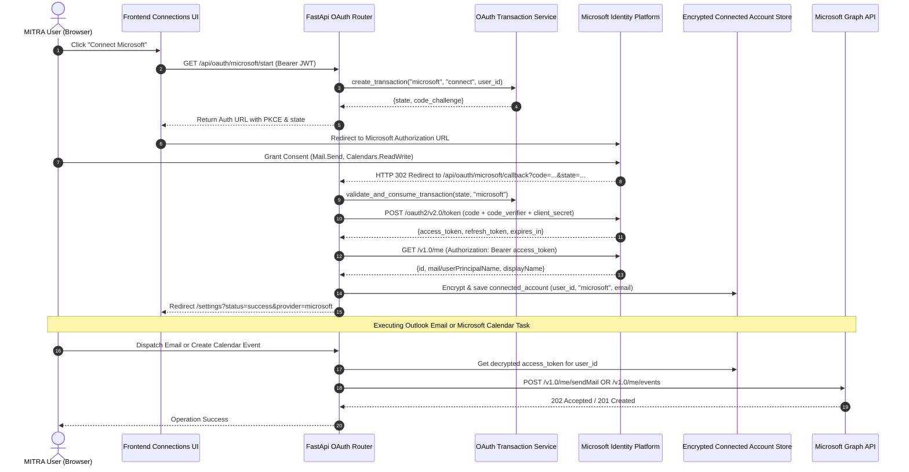

# MITRA Phase 6A — Microsoft OAuth + Outlook & Calendar Integration Documentation

## Overview

Phase 6A integrates Microsoft OAuth 2.0 Identity Platform into MITRA's provider-independent OAuth 2.0 architecture. This enables MITRA users to securely connect their personal or organizational Microsoft accounts to perform user-scoped **Outlook Email Dispatch** and **Microsoft Calendar Sync**.

### Key Architectural Highlights
- **Provider-Independent Integration**: Implements concrete `MicrosoftOAuthProvider` conforming to `BaseOAuthProvider`.
- **Authorization & Security Standard**: Enforces PKCE (S256), cryptographically random state tokens, single-use state consumption, and 10-minute state expiration.
- **Zero Token Leakage**: Access and refresh tokens are encrypted at rest with AES-256 (Fernet) and are strictly withheld from frontend API responses and logs.
- **User-Scoped Execution**: Dispatches Outlook emails and manages Microsoft Calendar events strictly using the authenticated user's OAuth tokens resolved via `TokenRefreshService`.

---

## OAuth 2.0 & Execution Architecture



---

## Azure Portal App Registration Setup Guide

To connect live Microsoft accounts, configure an application in Microsoft Entra ID (formerly Azure AD):

### 1. App Registration Steps
1. Log in to the [Azure Portal](https://portal.azure.com/).
2. Navigate to **Microsoft Entra ID** -> **App registrations** -> **New registration**.
3. Set **Name** to `MITRA Production Assistant`.
4. Set **Supported account types** to:
   - *Accounts in any organizational directory (Any Microsoft Entra ID directory - Multitenant) and personal Microsoft accounts (e.g. Skype, Xbox)* (Recommended: `common` tenant).
5. Set **Redirect URI**:
   - Platform: **Web**
   - Redirect URI: `http://localhost:8000/api/oauth/microsoft/callback` (or your domain callback URL).
6. Click **Register**.

### 2. Client Secret Generation
1. Under **Certificates & secrets**, select **Client secrets** -> **New client secret**.
2. Add description `MITRA Backend Secret` and select expiration period.
3. **Copy Secret Value immediately** (Value is hidden after leaving the page).

### 3. Required Delegated API Permissions
Under **API permissions** -> **Add a permission** -> **Microsoft Graph** -> **Delegated permissions**, grant:
- `openid` (Identity)
- `email` (Identity)
- `profile` (Identity)
- `User.Read` (Profile retrieval)
- `offline_access` (Refresh token maintenance)
- `Mail.Send` (Outlook email dispatch)
- `Calendars.ReadWrite` (Microsoft Calendar management)

---

## Environment Configuration Variables

Update `.env` (or refer to `.env.example`):

```bash
##############################
# OAUTH 2.0 CONFIGURATION (MICROSOFT)
##############################
MICROSOFT_CLIENT_ID=your_microsoft_application_client_id
MICROSOFT_CLIENT_SECRET=your_microsoft_client_secret_value
MICROSOFT_REDIRECT_URI=http://localhost:8000/api/oauth/microsoft/callback
MICROSOFT_TENANT_ID=common
```

---

## Endpoint Parity Matrix

| Method | Path | Scope / Purpose | Token Exposure |
|---|---|---|---|
| `GET` | `/api/oauth/microsoft/start` | Generates PKCE challenge & state | None (returns URL) |
| `GET` | `/api/oauth/microsoft/callback` | Server-side code exchange | None (encrypted storage) |
| `GET` | `/api/connections` | Lists safe connected account metadata | Strict Exclusion |
| `DELETE` | `/api/connections/microsoft` | Revokes & deletes connection | Strict Exclusion |

---

## Automated Verification Suite

All **88 / 88 automated tests** in the MITRA security test suite pass cleanly:

```bash
python -m pytest tests/test_security_phase1.py tests/test_idor_phase2.py tests/test_credentials_phase3.py tests/test_oauth_phase4.py tests/test_google_e2e_phase5.py tests/test_microsoft_oauth_phase6.py -v
```

### Passing Test Breakdown:
- **Phase 1 (JWT Core & Auth Dependencies)**: 8/8 PASSED
- **Phase 2 (IDOR & Tenant Isolation)**: 20/20 PASSED
- **Phase 3 (AES-256 Credentials & OTP Guard)**: 17/17 PASSED
- **Phase 4 (OAuth Infrastructure Foundation)**: 18/18 PASSED
- **Phase 5 (Google E2E OAuth Parity)**: 10/10 PASSED
- **Phase 6A (Microsoft OAuth, Outlook & Calendar)**: 15/15 PASSED
- **Total**: **88 / 88 PASSED (100%)**
