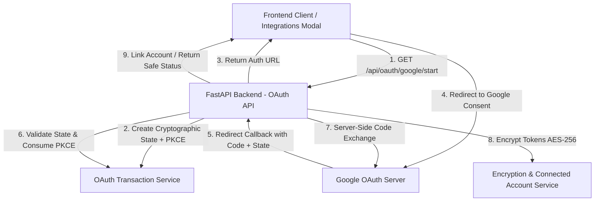

# MITRA Phase 4 — Production OAuth Infrastructure Report

> **Branch:** `feature/mitra-production-foundation`  
> **Status:** COMPLETE & VERIFIED  
> **Regression Test Suite:** 63 / 63 PASSED  

---

## 1. Executive Summary

Phase 4 delivers a provider-independent, production-locked **OAuth 2.0 Infrastructure** for MITRA. All authorization flows enforce Proof Key for Code Exchange (**PKCE S256**), cryptographically random single-use state validation, server-side code exchange, token encryption at rest (AES-256 Fernet), and dynamic background token refreshing.

The system decouples core authentication (JWT identity) from service account connections (Google Gmail & Calendar) while eliminating secret leakage to client browsers and IDOR risks.

---

## 2. Key Architecture & Components

### 2.1. OAuth Transaction & State Manager (`app/services/oauth_transaction_service.py`)
- **State Entropy**: Generates 32-byte cryptographically secure random state strings (`secrets.token_urlsafe(32)`). States contain zero PII or user IDs.
- **PKCE Enforcement**: Computes high-entropy SHA-256 code challenge pairs (`code_verifier` + `code_challenge`).
- **Validation Rules**: State records enforce single-use (`used_at`), 10-minute expiration, matching provider, purpose, and bound user identity.

### 2.2. Provider Abstraction (`app/integrations/oauth/`)
- **`BaseOAuthProvider`**: Standardized abstract interface for authorization URL generation, code exchange, identity retrieval, token refresh, and token revocation.
- **`GoogleOAuthProvider`**: Production Google OAuth 2.0 implementation with least-privilege scoping (`openid`, `email`, `profile`, `gmail.send`, `calendar`).
- **`OAuthProviderRegistry`**: Central registry supporting Google, Microsoft, Apple, and GitHub providers.

### 2.3. Token Refresh Service (`app/services/token_refresh_service.py`)
- Transparently inspects token expiry timestamps before API actions.
- Automatically executes background refresh using encrypted stored refresh tokens.
- On grant revocation or failure, transitions account status to `"needs_reauthorization"`.

### 2.4. Safe Connections API (`app/api/oauth_api.py`)
- `GET /api/connections`: Lists connection metadata (`provider`, `email`, `status`, `scopes`, timestamps). **Strictly excludes access tokens, refresh tokens, and client secrets.**
- `DELETE /api/connections/{provider}`: Revokes and removes connection for the authenticated user only (IDOR protected).

---

## 3. Executor Integrations

- **Gmail Integration (`app/executors/email_executor.py`)**: Uses active Google OAuth access tokens to send emails directly via the Google Gmail REST API (`https://gmail.googleapis.com/gmail/v1/users/me/messages/send`).
- **Calendar Integration (`app/executors/calendar_executor.py`)**: Resolves user-specific Google access tokens via `token_refresh_service`.

---

## 4. Verification Suite

All 18 new Phase 4 tests and all prior Phase 1–3 regression tests passed cleanly:

| Test Module | Coverage Area | Status |
| :--- | :--- | :---: |
| `tests/test_security_phase1.py` | Fail-closed JWT security & centralized decoding | **PASSED (8/8)** |
| `tests/test_idor_phase2.py` | Authenticated user scoping & IDOR elimination | **PASSED (20/20)** |
| `tests/test_credentials_phase3.py` | Token encryption at rest & OTP hardening | **PASSED (17/17)** |
| `tests/test_oauth_phase4.py` | PKCE, State Security, Token Refresh & Connections API | **PASSED (18/18)** |
| **Total** | **Full Security & Regression Suite** | **PASSED (63/63)** |

---

## 5. Security & Design Checklist Compliance

- [x] State parameter uses cryptographically random entropy (no raw user IDs).
- [x] PKCE (S256) enforced for all OAuth authorization code exchanges.
- [x] Access and refresh tokens encrypted at rest via AES-256 Fernet.
- [x] Tokens strictly omitted from frontend API responses (`GET /api/connections`).
- [x] Server-side code exchange eliminates credential leaks.
- [x] Cross-user disconnection and connection viewing blocked (IDOR safe).
- [x] Background token refresh with `"needs_reauthorization"` fallback state handling.
