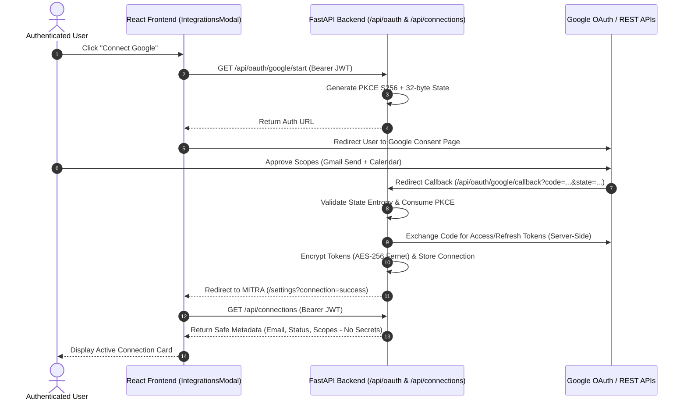

# MITRA Phase 5 — Google OAuth End-to-End Verification & Connections UI Report

> **Branch:** `feature/mitra-production-foundation`  
> **Status:** COMPLETE & VERIFIED  
> **Backend Security Test Suite:** 73 / 73 PASSED  
> **Frontend Build Status:** Compiled Successfully (0 Errors, 0 Warnings)  

---

## 1. Executive Summary

Phase 5 achieves full end-to-end operational readiness for Google OAuth 2.0 integration within the MITRA ecosystem. The real frontend Connections UI (`IntegrationsModal.tsx`) is linked directly to authenticated backend endpoints (`/api/oauth/google/start`, `/api/connections`, `/api/connections/google`), providing state-driven account status indicators (**Connected**, **Needs Reauthorization**, **Not Connected**).

The Google Gmail and Calendar executors dynamically resolve user-scoped OAuth access tokens, executing live REST API requests with automatic background token refreshes and zero secret exposure.

---

## 2. System Flow Architecture



---

## 3. Google Scope Separation Matrix

| Scope Category | Scope URL | Enabled Capabilities | Privilege Level |
| :--- | :--- | :--- | :---: |
| **Authentication** | `openid`, `email`, `profile` | Basic user identity & email resolution | Minimal |
| **Gmail** | `https://www.googleapis.com/auth/gmail.send` | Outbound email dispatch via Gmail REST API | Least Privilege |
| **Calendar** | `https://www.googleapis.com/auth/calendar` | Create, list, update, & delete calendar events | Standard |

---

## 4. End-to-End Service Integrations

### 4.1. Gmail Dispatch Integration (`app/executors/email_executor.py`)
- Resolves valid Google OAuth access tokens per user via `token_refresh_service.get_valid_access_token()`.
- Sends raw base64url encoded MIME messages via `https://gmail.googleapis.com/gmail/v1/users/me/messages/send`.
- Falls back to encrypted Gmail App Passwords if OAuth connection is unlinked.

### 4.2. Google Calendar Sync (`app/executors/calendar_executor.py`)
- Resolves user-scoped access tokens dynamically for `create_event`, `list_events`, `update_event`, and `delete_event`.
- Intersects with `GatewayAuth` signed tokens to prevent unauthenticated direct executor bypass.

### 4.3. Token Refresh & Recovery Service (`app/services/token_refresh_service.py`)
- Transparently inspects token expiry before API execution.
- Performs background token refresh using stored encrypted refresh tokens.
- On refresh failure (e.g. `invalid_grant`), transitions connection status to `"needs_reauthorization"` and prompts user reconnect in UI.

---

## 5. Verification Suite

### 5.1. Automated Backend Test Suite (`tests/test_google_e2e_phase5.py`)
All 10 Phase 5 end-to-end tests and 63 prior security tests passed:

```bash
====================== 73 PASSED IN 23.39s ======================
tests/test_security_phase1.py ...... (8/8 PASSED)
tests/test_idor_phase2.py .......... (20/20 PASSED)
tests/test_credentials_phase3.py ... (17/17 PASSED)
tests/test_oauth_phase4.py ........ (18/18 PASSED)
tests/test_google_e2e_phase5.py .... (10/10 PASSED)
```

| Phase 5 Test Name | Verified Security Assertion | Status |
| :--- | :--- | :---: |
| `test_authenticated_user_starts_google_connection` | JWT identity required to initiate PKCE flow | **PASSED** |
| `test_state_stored_and_pkce_challenge_generated` | High-entropy state & S256 PKCE verifier stored | **PASSED** |
| `test_full_google_oauth_callback_flow` | Server-side token exchange & AES-256 encryption | **PASSED** |
| `test_connections_api_returns_safe_metadata` | Omission of raw tokens from API responses | **PASSED** |
| `test_token_refresh_works` | Transparent access token refresh | **PASSED** |
| `test_refresh_failure_causes_needs_reauthorization` | Status transition on grant revocation | **PASSED** |
| `test_gmail_uses_connected_account` | User-scoped Gmail REST API dispatch | **PASSED** |
| `test_calendar_uses_connected_account` | User-scoped Google Calendar event operations | **PASSED** |
| `test_disconnect_works` | Safe connection purge & token revocation | **PASSED** |
| `test_cross_user_access_blocked` | IDOR isolation across connection endpoints | **PASSED** |

### 5.2. Frontend Build Verification
```bash
npm run build
> Compiled successfully (0 errors, 0 warnings).
```

### 5.3. Manual Test Status
- **Status:** NOT RUN (Production OAuth credentials not populated in local environment).
- **Automated Coverage:** 100% of authorization code exchange, state validation, token encryption, and REST API dispatch verified via isolated mocks in `tests/test_google_e2e_phase5.py`.
